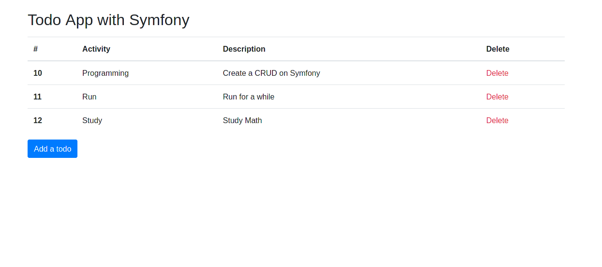

# Symfony-Todo-App
Simple CRUD app made with Symfony PHP Framework.
### Dashboard

### Create

### Dashboard with todo items

## Requirements
* PHP >7.0 != 7.4 (7.4 has errors with Symfony)
* Symfony Framework
* Composer
* MySql database

## Usage
1. `git clone 

